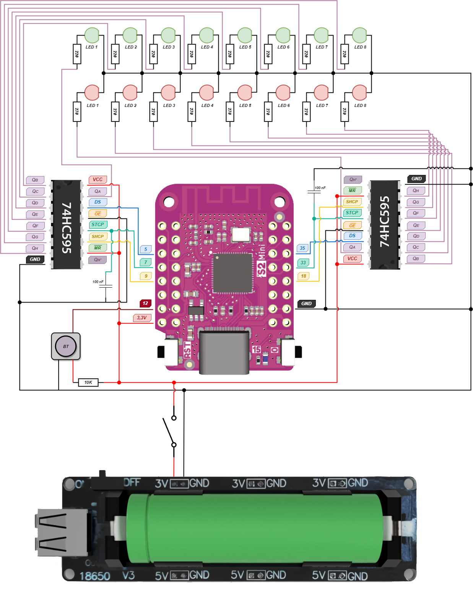

# charly-game-led

A Game Led with an ESP-32 Lolin S2 mini, 2 shift registers 74HC595 and 16 leds, for my Son.

## Definitions
### What is the 74HC595?
The 74HC595 is an 8-bit serial-in, parallel-out shift register.
It allows you to control 8 output pins using only 3 microcontroller pins, making it ideal for saving GPIOs when controlling multiple outputs like LEDs.

### Key features:
- 8-bit register (controls 8 outputs: Q0 → Q7)
- Serial input (data is fed one bit at a time)
- Parallel output (all outputs updated together)
- Latch pin to update outputs simultaneously
- Can be chained to control 16, 24, or more outputs

### How it works:
You control it using 3 main control pins:
1. DS (Data) – where the bits enter one by one
2. SHCP (Clock) – shifts bits into the register on each rising edge
3. STCP (Latch) – updates the outputs when pulsed HIGH

👉 Step-by-step:
1. You send 8 bits of data serially via DS, pulsing SHCP after each bit.
2. Once all 8 bits are loaded, you pulse STCP HIGH.
3. The 8 output pins (Q0–Q7) are updated simultaneously to reflect the new data.

## Electric Diagram

